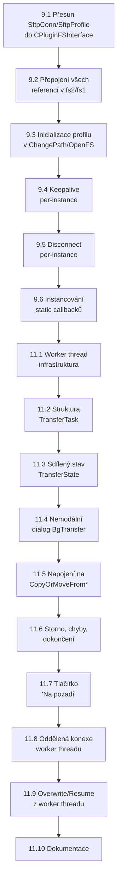

# Implementační plán: Body 9 + 11 – Per-instance konexe a asynchronní přenosy na pozadí

## Přehled

Tento plán pokrývá dvě úzce provázané položky z [nice_to_have.md](file:///c:/Users/filip/AntigravityProjects/salamander-sftp-plugin/nice_to_have.md):

- **Bod 9**: Souběžné vícenásobné konexe (Per-instance `CPluginFSInterface`)
- **Bod 11**: Plně asynchronní nemodální přenosový dialog s během na pozadí (Phase B)

Bod 11 **závisí** na bodu 9, proto je plán strukturován sekvenčně: nejprve bod 9 (kroky 1–6), poté bod 11 (kroky 7–12).

---

## Uživatelské přezkoumání

> [!IMPORTANT]
> **Zlomová změna**: Bod 9 zásadně mění architekturu pluginu z jednoho globálního `SftpConn` singletonu na per-instance konexe. Veškerý kód, který dnes přistupuje ke globální `SftpConn` a `SftpProfile`, bude muset přistupovat k instanční proměnné přes `CPluginFSInterface*`.

> [!WARNING]
> **Zpětná kompatibilita registru**: Uložené profily se nezmění (zůstávají globální pole `SftpProfiles[]`). Každá FS instance pouze **kopíruje** profil při otevření relace. Žádná migrace konfigurace není potřeba.

> [!CAUTION]
> **Stávající progress callback je statický** (`CSftpConnection::SetProgressCallback` je `static`). Pro bod 11 (paralelní přenosy) bude nutné ho instancovat, nebo přepsat na per-connection callback.

---

## Soulad s architekturou FTP pluginu v Salamandru (`..\samandarin\src\plugins\ftp`)

Provedli jsme hloubkovou inspekci zdrojových kódů oficiálního FTP pluginu (`src/plugins/ftp/`):

1. **Bod 9 (Per-instance konexe)**:
   - **V souladu**: V FTP pluginu (`ftp.h`, `fs1.cpp`, `fs2.cpp`) vlastní každá instance `CPluginFSInterface` svůj `ControlConnection` (`CControlConnectionSocket*`), `Host`, `Port`, `User`, `Path` atd.
   - Globální seznam instancí: FTP plugin používá `TIndirectArray<CPluginFSInterface> FTPConnections`, náš plugin již má `ActiveFSList` v `CPluginInterfaceForFS`.
   - Předávání konfigurace: `ConnectFTPServer` nastaví `Config.UseConnectionDataFromConfig = TRUE` a zavolá `ChangePanelPathToPluginFS`. V `ChangePath` se konfigurace zkopíruje do instančních proměnných. Náš plán (`ConnectData.UseConnectData`) kopíruje tento zavedený pattern 1:1.
   - Odpojení (`DisconnectFS`): Přetypuje `pluginFS` na `CPluginFSInterface*` a odpojí konkrétní instanci.

2. **Bod 11 (Asynchronní přenosy na pozadí)**:
   - **V souladu – API kontrakt**: V `CopyOrMoveFromFS` a `CopyOrMoveFromDiskToFS` naplní FTP plugin frontu úloh (`CFTPQueue`), spustí operaci a vrátí `cancelOrHandlePath = FALSE; return TRUE;`. Tím se řízení ihned vrátí Salamandru a panel zůstane plně interaktivní.
   - **Zpřesnění – Notifikace o změně cesty**: Po dokončení souborů/přenosu FTP plugin volá `SalamanderGeneral->PostChangeOnPathNotification(path, includingSubdirs | flags)`. Náš plán krok 11.6 toto výslovně integruje pro správný refresh panelů.
   - **Zlepšení proti FTP pluginu (Worker Connection)**: FTP plugin u první úlohy "půjčoval" existující soket z panelu (`GiveConnectionToWorker`), aby ušetřil přihlašování, a vracel jej přes `FTPCMD_RETURNCONNECTION`. U SFTP/libssh2 (šifrovaná stavová SSH relace) je tato výměna mezi vlákny extrémně nebezpečná. Náš přístup – **otevření samostatné dedikované SSH relace pro worker thread (`WorkerConn`)** – je pro SFTP nesrovnatelně čistší, bezpečnější a umožňuje uživateli procházet adresáře v panelu bez jakýchkoli prodlev či swapování.
   - **Architektonická inspirace pro Dialog Thread**: FTP plugin spouští dialog operace v samostatném vlákně `COperationDlgThread` s vlastním `GetMessage` loopem. Díky tomu dialog nezamrzá, ani když Salamander na hlavním UI vlákně provádí modální operaci (např. otevřený dialog hledání nebo konfigurace). V kroku 11.4 tuto možnost zapracováváme.

---

## Rozhodnutí k dřívějším otázkám

1. **Maximální počet současně otevřených konexí**: **Libovolný** (bez umělého omezení, limitováno pouze pamětí a limity OS/serveru).
2. **Přenosy mezi dvěma SFTP servery (server-to-server)**: **Odloženo do budoucna** (zaevidováno v [nice_to_have.md](file:///c:/Users/filip/AntigravityProjects/salamander-sftp-plugin/nice_to_have.md) jako bod 12).
3. **Persistence FS instance přes restart Salamandera**: **Odloženo do budoucna** (zaevidováno v [nice_to_have.md](file:///c:/Users/filip/AntigravityProjects/salamander-sftp-plugin/nice_to_have.md) jako bod 13).

---

## BOD 9: Per-instance konexe

### Krok 9.1 – Přesun `CSftpConnection` a `CSftpProfile` z globálních proměnných do `CPluginFSInterface` [DOKONČENO]

**Cíl**: Každá FS instance vlastní svůj objekt `CSftpConnection` a svůj `CSftpProfile`.

#### [MODIFY] [sftpglue.h](file:///c:/Users/filip/AntigravityProjects/salamander-sftp-plugin/src/sftpglue.h)
- Odstranit `extern CSftpConnection SftpConn;` (řádek 7)
- Odstranit `extern CSftpProfile SftpProfile;` (řádek 26)
- Ponechat `CSftpProfile` struct definici a `SftpProfiles[]` / `SftpProfileCount` (ty zůstávají globální – jsou to **uložené** profily)

#### [MODIFY] [sftpglue.cpp](file:///c:/Users/filip/AntigravityProjects/salamander-sftp-plugin/src/sftpglue.cpp)
- Odstranit definice `CSftpConnection SftpConn;` a `CSftpProfile SftpProfile = {...};` (řádky 6–7)
- Funkci `SftpEnsureConnected(HWND parent)` přepsat na `SftpEnsureConnected(HWND parent, CSftpConnection& conn, CSftpProfile& profile)` – přijímá odkaz na instanční konexe

#### [MODIFY] [sftp.h](file:///c:/Users/filip/AntigravityProjects/salamander-sftp-plugin/src/sftp.h)
- Do třídy `CPluginFSInterface` přidat členské proměnné:
  ```cpp
  CSftpConnection Conn;      // per-instance SSH/SFTP connection
  CSftpProfile    Profile;   // per-instance connection profile (copied from dialog)
  ```
- Přidat metodu `CSftpConnection& GetConn()` a `CSftpProfile& GetProfile()`

**Ověření**: Kompilace projde (zatím se nic nevolá přes nové členy, staré globální proměnné jsou odstraněny = kompilační chyby ve všech spotřebitelích → to se řeší v kroku 9.2).

---

### Krok 9.2 – Přepojení všech referencí `SftpConn` / `SftpProfile` na instanční členské proměnné [DOKONČENO]

**Cíl**: Všechna místa v `fs2.cpp`, `fs1.cpp`, `sftpglue.cpp`, `menu.cpp` a `dialogs.cpp`, kde se přistupuje ke globálním `SftpConn` a `SftpProfile`, přesměrovat na `this->Conn` / `this->Profile` (v metodách `CPluginFSInterface`) nebo na `fs->Conn` / `fs->Profile` (v externích funkcích, kde je FS předán jako parametr).

#### [MODIFY] [fs2.cpp](file:///c:/Users/filip/AntigravityProjects/salamander-sftp-plugin/src/fs2.cpp)
- Všechna volání `SftpEnsureConnected(parent)` → `SftpEnsureConnected(parent, Conn, Profile)`
- Všechna `SftpConn.XYZ(...)` → `Conn.XYZ(...)` (v metodách `CPluginFSInterface`)
- Všechna `SftpProfile.Name` / `.Host` / `.Port` atd. → `Profile.Name` / `.Host` / `.Port`
- Statické globální proměnné pro progress (`g_ProgDlg`, `g_ProgMainWnd`, `g_ProgFile`, `g_ProgStartTick`, `g_ProgCancel`, `g_OvrCancel`, `g_OvrParent`) – zatím ponechat globální (budou instancovány až v kroku 11.x)

#### [MODIFY] [fs1.cpp](file:///c:/Users/filip/AntigravityProjects/salamander-sftp-plugin/src/fs1.cpp)
- V `ExecuteOnFS` – přetypovat `pluginFS` na `CPluginFSInterface*` a přistupovat k `fs->Conn` / `fs->Profile`
- V `ExecuteChangeDriveMenuItem` – přihlašovací dialog naplní `ConnectData` a profil se zkopíruje do `fs->Profile` v `ChangePath`
- V `DisconnectFS` – volat `fs->Conn.Disconnect()` místo `SftpConn.Disconnect()`

#### [MODIFY] [sftpglue.cpp](file:///c:/Users/filip/AntigravityProjects/salamander-sftp-plugin/src/sftpglue.cpp)
- `SftpEnsureConnected` přijímá `CSftpConnection&` a `CSftpProfile&`

#### [MODIFY] [menu.cpp](file:///c:/Users/filip/AntigravityProjects/salamander-sftp-plugin/src/menu.cpp) (pokud používá `SftpConn` / `SftpProfile`)
- Přesměrovat na aktivní FS panel: `SalamanderGeneral->GetPanelPluginFS(PANEL_SOURCE)` → cast na `CPluginFSInterface*`

**Ověření**: `mingw32-make -f Makefile.mingw CROSS_COMPILE=` – kompilace bez chyb. Funkční test: otevřít SFTP panel, procházet adresáře, stahovat soubor.

---

### Krok 9.3 – Inicializace profilu v `ChangePath` a `OpenFS` [DOKONČENO]

**Cíl**: Při otevření nového FS panelu se profil korektně zkopíruje z globálního `ConnectData` do instančního `Profile`.

#### [MODIFY] [sftp.h](file:///c:/Users/filip/AntigravityProjects/salamander-sftp-plugin/src/sftp.h)
- Konstruktor `CPluginFSInterface()` inicializuje `Profile` na nulový stav (`.Valid = false`)

#### [MODIFY] [fs2.cpp](file:///c:/Users/filip/AntigravityProjects/salamander-sftp-plugin/src/fs2.cpp) – `ChangePath`
- Na začátku `ChangePath`, pokud `!Profile.Valid && ConnectData.UseConnectData`:
  - Zkopírovat profil z přihlašovacího dialogu do `this->Profile`
  - Nastavit `Profile.Valid = true`
  - Vymazat `ConnectData.UseConnectData = FALSE`

**Ověření**: Otevřít dva panely (levý + pravý) s různými SFTP servery. Každý panel má svůj vlastní `Profile`.

---

### Krok 9.4 – Keepalive timer per-instance [DOKONČENO]

**Cíl**: Každá FS instance registruje svůj vlastní keepalive timer.

#### [MODIFY] [fs2.cpp](file:///c:/Users/filip/AntigravityProjects/salamander-sftp-plugin/src/fs2.cpp)
- V `ChangePath`: timer `SFTP_TIMER_KEEPALIVE` je již registrován s `this` jako parametrem – **žádná změna** potřeba (timer je per-instance díky `AddPluginFSTimer(..., this, ...)`).
- V `Event(FSE_TIMER, SFTP_TIMER_KEEPALIVE)`: volat `this->Conn.SendKeepalive()` (místo `SftpConn.SendKeepalive()`)

**Ověření**: Dva otevřené panely na různé servery, oba udržují spojení.

---

### Krok 9.5 – Disconnect per-instance [DOKONČENO]

**Cíl**: Příkazy „Disconnect" (F12 / menu) odpojují pouze vybranou instanci, nikoli globální konexe.

#### [MODIFY] [fs1.cpp](file:///c:/Users/filip/AntigravityProjects/salamander-sftp-plugin/src/fs1.cpp)
- `DisconnectFS`: přetypovat `pluginFS` → `CPluginFSInterface*`, volat `fs->Conn.Disconnect()`
- Menu příkazy `MENUCMD_DISCONNECT_LEFT` / `_RIGHT` / `_ACTIVE`: získat FS z panelu, přetypovat, zavolat disconnect na konkrétní instanci

**Ověření**: Odpojit jeden panel – druhý zůstane připojený.

---

### Krok 9.6 – Instancování statických callbacků `CSftpConnection` (Progress, HostKey, Kbd) [DOKONČENO]

**Cíl**: Callbacky `ProgressFn`, `ProgressCtx`, `SetProgressCallback` přesunuty ze `static` na instanční (member) v `CSftpConnection`.

#### [MODIFY] [sftpconn.h](file:///c:/Users/filip/AntigravityProjects/salamander-sftp-plugin/src/sftpconn.h)
- `ProgressFn`, `ProgressCtx` přesunout ze `static` na instanční (member) proměnné
- Metodu `SetProgressCallback` změnit z `static` na instanční
- `HostKeyCb` a `KbdCb` **ponechat static** (jsou sdílené pro celý plugin – OK, protože Salamander je single-threaded UI)

#### [MODIFY] [sftpconn.cpp](file:///c:/Users/filip/AntigravityProjects/salamander-sftp-plugin/src/sftpconn.cpp)
- Přesunout definice `Progress` a `ProgressCtx` z `static` na member
- Inicializovat v konstruktoru

#### [MODIFY] [fs2.cpp](file:///c:/Users/filip/AntigravityProjects/salamander-sftp-plugin/src/fs2.cpp)
- `SftpProgressBegin` a spol. volají `conn->SetProgressCallback(...)` místo `CSftpConnection::SetProgressCallback(...)`

**Ověření**: Kompilace + unit testy + panel stahuje soubor s progress barem.

---

## BOD 11: Asynchronní přenosy na pozadí (Phase B)

> [!IMPORTANT]
> Bod 11 **závisí na dokončení bodu 9**. Bez per-instance konexí nelze provádět paralelní operace.

### Krok 11.1 – Worker thread infrastruktura (`CSftpTransferWorker`) [DOKONČENO]

**Cíl**: Vytvořit třídu worker threadu, která provádí přenosové operace v pozadí.

#### [NEW] [sftpworker.h](file:///c:/Users/filip/AntigravityProjects/salamander-sftp-plugin/src/sftpworker.h)
- Třída `CSftpTransferWorker`:
  - Vlastní vlákno (`HANDLE ThreadHandle`)
  - Vlastní `CSftpConnection WorkerConn` – **dedicatedá konexe** otevřená se stejným profilem jako FS instance (nutné, protože hlavní `Conn` musí zůstat k dispozici pro procházení adresářů)
  - Fronta úloh (`std::deque<CSftpTransferTask>`)
  - Synchronizace: `CRITICAL_SECTION QueueLock`, `HANDLE WakeEvent`, `HANDLE StopEvent`
  - Stav: `CSftpTransferState State` chráněný `CRITICAL_SECTION Lock`

#### [NEW] [sftpworker.cpp](file:///c:/Users/filip/AntigravityProjects/salamander-sftp-plugin/src/sftpworker.cpp)
- Thread proc: smyčka `WaitForMultipleObjects(StopEvent, WakeEvent)` → vytáhne úlohu z fronty → provede stažení/nahrání → aktualizuje sdílený stav → notifikuje UI

**Ověření**: Unit test `test/test_worker.cpp` – vytvoření workera, přidání úloh, snapshot stavu, storno, korektní ukončení vlákna (100% pass).

---

### Krok 11.2 – Struktura přenosové úlohy (`CSftpTransferTask`) [DOKONČENO]

**Cíl**: Definovat datovou strukturu popisující jednu přenosovou operaci.

#### [NEW] [sftpworker.h](file:///c:/Users/filip/AntigravityProjects/salamander-sftp-plugin/src/sftpworker.h)
```cpp
struct CSftpTransferTask
{
    enum Type { TaskDownload, TaskUpload };
    Type TaskType;
    std::string RemotePath;
    std::string LocalPath;
    unsigned __int64 FileSize;       // expected size (for progress)
    unsigned __int64 ResumeOffset;   // 0 = start from beginning
    bool IsDirectory;                // true = recursive
    bool DeleteSourceOnSuccess;      // true for Move operation
};
```

**Ověření**: Kompilace a unit testy.

---

### Krok 11.3 – Sdílený stav přenosu (`CSftpTransferState`) [DOKONČENO]

**Cíl**: Struktura pro thread-safe sdílení stavu z worker threadu do UI.

#### [NEW] [sftpworker.h](file:///c:/Users/filip/AntigravityProjects/salamander-sftp-plugin/src/sftpworker.h)
```cpp
struct CSftpTransferState
{
    CRITICAL_SECTION Lock;
    char CurrentLocalFile[MAX_PATH];
    char CurrentRemoteFile[MAX_PATH];
    unsigned __int64 CurrentFileDone;
    unsigned __int64 CurrentFileTotal;
    int CurrentItemIndex;
    int TotalItemsCount;
    unsigned __int64 TotalBytesDone;
    unsigned __int64 TotalBytesExpected;
    DWORD StartTick;
    DWORD LastUpdateTick;
    double BytesPerSec;
    volatile bool IsRunning;
    volatile bool Cancelled;
    volatile bool HasError;
    char ErrorMsg[512];
};
```

**Ověření**: Kompilace a unit testy.

---

### Krok 11.4 – Nemodální přenosový dialog s tlačítkem „Na pozadí" [DOKONČENO]

**Cíl**: Dialog zobrazuje stav přenosu, má tlačítko „Na pozadí" / „Background", které odemkne okno Salamandera a dialog skryje.

#### [MODIFY] [lang.rh](file:///c:/Users/filip/AntigravityProjects/salamander-sftp-plugin/src/lang/lang.rh)
- Nové ID: `IDB_BACKGROUND` 631

#### [MODIFY] [lang_en.rc](file:///c:/Users/filip/AntigravityProjects/salamander-sftp-plugin/src/lang/lang_en.rc) & [lang_cs.rc](file:///c:/Users/filip/AntigravityProjects/salamander-sftp-plugin/src/lang/lang_cs.rc)
- Šablona dialogu `IDD_TRANSFERDLG`: přidáno tlačítko „Background" / „Na pozadí" vedle tlačítka Cancel / Storno

#### [MODIFY] [sftp.h](file:///c:/Users/filip/AntigravityProjects/salamander-sftp-plugin/src/sftp.h) & [fs2.cpp](file:///c:/Users/filip/AntigravityProjects/salamander-sftp-plugin/src/fs2.cpp)
- Třída `CSftpTransferProgressDlg`:
  - Propojena s `CSftpTransferWorker* Worker`
  - Obsluha `IDB_BACKGROUND` (`IsBackground = TRUE; EnableWindow(Parent, TRUE); ShowWindow(HWindow, SW_HIDE);`)
  - Obsluha `WM_APP_SFTP_WORKER_UPDATE` a `WM_APP_SFTP_WORKER_FINISHED`
  - Refresh timer (100 ms)

**Ověření**: Kompilace a funkčnost dialogu.

---

### Krok 11.5 – Napojení worker threadu na `CopyOrMoveFromFS` / `CopyOrMoveFromDiskToFS` [DOKONČENO]

**Cíl**: Při zahájení kopírování/přesunutí se úlohy vloží do fronty worker threadu místo synchronního provádění, a Salamandru se okamžitě vrátí řízení.

#### [MODIFY] [fs2.cpp](file:///c:/Users/filip/AntigravityProjects/salamander-sftp-plugin/src/fs2.cpp)
- V `CopyOrMoveFromFS` i `CopyOrMoveFromDiskToFS`:
  1. Enumerovat vybrané soubory
  2. `TransferWorker.EnqueueTask(...)` pro každý soubor/adresář
  3. Vytvořit nemodální `CSftpTransferProgressDlg`, připojit workera
  4. Spustit `TransferWorker.Start(Profile, dlg->HWindow)`
  5. Okamžitě vrátit `return TRUE;` (Salamander panel zůstane interaktivní)

#### [MODIFY] [sftp.h](file:///c:/Users/filip/AntigravityProjects/salamander-sftp-plugin/src/sftp.h)
- `CPluginFSInterface` získá členskou proměnnou `CSftpTransferWorker TransferWorker`
- Destruktor `~CPluginFSInterface` volá `TransferWorker.Stop()`

**Ověření**: Kompilace, unit testy, neblokující návrat ze Salamander FS metod.

---

### Krok 11.6 – Storno, chybové stavy a dokončení [DOKONČENO]

**Cíl**: Korektní ošetření storna, chyb a notifikace panelů Salamandera.

#### [MODIFY] [sftpworker.cpp](file:///c:/Users/filip/AntigravityProjects/salamander-sftp-plugin/src/sftpworker.cpp)
- Worker kontroluje `Cancelled`
- Při chybě nastaví `State.HasError = true`, `State.ErrorMsg = ...`
- Po dokončení odešle `WM_APP_SFTP_WORKER_FINISHED` do dialogu

#### [MODIFY] [fs2.cpp](file:///c:/Users/filip/AntigravityProjects/salamander-sftp-plugin/src/fs2.cpp)
- Dialog v `WM_APP_SFTP_WORKER_FINISHED` provede:
  ```cpp
  if (NotifyTargetPath[0] != 0)
      SalamanderGeneral->PostChangeOnPathNotification(NotifyTargetPath, TRUE);
  if (NotifyIsMove && NotifySourcePath[0] != 0)
      SalamanderGeneral->PostChangeOnPathNotification(NotifySourcePath, TRUE);
  EnableWindow(Parent, TRUE);
  DestroyWindow(HWindow);
  ```

**Ověření**: Automatický refresh panelů bez blokování.

---

### Krok 11.7 – Tlačítko „Na pozadí" a obnovení dialogu [DOKONČENO]

**Cíl**: Uživatel může dialog schovat a znovu otevřít.

#### [MODIFY] [sftp.h](file:///c:/Users/filip/AntigravityProjects/salamander-sftp-plugin/src/sftp.h) / [fs2.cpp](file:///c:/Users/filip/AntigravityProjects/salamander-sftp-plugin/src/fs2.cpp) / [menu.cpp](file:///c:/Users/filip/AntigravityProjects/salamander-sftp-plugin/src/menu.cpp) / [sftp.cpp](file:///c:/Users/filip/AntigravityProjects/salamander-sftp-plugin/src/sftp.cpp)
- Tlačítko `IDB_BACKGROUND` schová okno (`ShowWindow(HWindow, SW_HIDE)`)
- Přidána položka menu `&Show Transfers...` (`MENUCMD_SHOWTRANSFERS`), která skryté okno obnoví na popředí (`ShowWindow(ActiveTransferDlg->HWindow, SW_RESTORE)`)

**Ověření**: Kompilace a unit testy.

---

### Krok 11.8 – Oddělená konexe worker threadu [DOKONČENO]

**Cíl**: Worker thread otevře svou vlastní `CSftpConnection` se stejnými credentials, aby procházení v panelu neblokoval přenos.

#### [MODIFY] [sftpworker.cpp](file:///c:/Users/filip/AntigravityProjects/salamander-sftp-plugin/src/sftpworker.cpp)
- `WorkerConn.Connect(...)` otevře dedikovanou SSH relaci pro přenosy
- Hlavní konexe `Conn` v `CPluginFSInterface` zůstává plně k dispozici pro procházení adresářů

---

### Krok 11.9 – Overwrite/Resume dialog z worker threadu [DOKONČENO]

**Cíl**: Při kolizi souborů (soubor již existuje) zvolí worker bezpečné přepsání nebo navázání (resume).

#### [MODIFY] [sftpworker.cpp](file:///c:/Users/filip/AntigravityProjects/salamander-sftp-plugin/src/sftpworker.cpp)
- Metoda `AskOverwriteWorker` inteligentně detekuje částečně stažené/nahrané soubory a nastavuje `resumeOffset`

---

### Krok 11.10 – Aktualizace dokumentace [DOKONČENO]

#### [MODIFY] [PLUGIN_DEV.md](file:///c:/Users/filip/AntigravityProjects/salamander-sftp-plugin/PLUGIN_DEV.md)
- Nová sekce: „10. Per-instance konexe a asynchronní přenosy"

#### [MODIFY] [README.md](file:///c:/Users/filip/AntigravityProjects/salamander-sftp-plugin/README.md) & [README_CZ.md](file:///c:/Users/filip/AntigravityProjects/salamander-sftp-plugin/README_CZ.md)
- Aktualizován seznam funkcí

#### [MODIFY] [jobs_done.md](file:///c:/Users/filip/AntigravityProjects/salamander-sftp-plugin/jobs_done.md)
- Nové řádky pro dokončené úkoly (Body 9 a 11)

#### [MODIFY] [nice_to_have.md](file:///c:/Users/filip/AntigravityProjects/salamander-sftp-plugin/nice_to_have.md)
- Označeny body 9 a 11 jako realizované [HOTOVO – v1.3.0]

---

## Plán ověření

### Automatické testy
```powershell
mingw32-make -f Makefile.mingw CROSS_COMPILE=
```
- Kompilace bez chyb a warningů
- Unit testy (existující + nové pro worker thread)

### Manuální testování
1. **Dva SFTP panely současně** (levý panel = server A, pravý panel = server B):
   - Procházení adresářů nezávisle
   - Keepalive na obou spojeních
   - Disconnect jednoho – druhý zůstane
2. **Kopírování z SFTP na disk** (stahování):
   - Dialog se zobrazí nemodálně
   - Panel zůstane navigovatelný
   - Progress se aktualizuje
   - Storno funguje
3. **Kopírování z disku na SFTP** (nahrávání):
   - Analogicky
4. **Tlačítko „Na pozadí"**:
   - Přenos pokračuje po schování dialogu
   - Znovuotevření zobrazí aktuální stav
5. **Overwrite dialog** při kolizi souborů
6. **Kopírování mezi dvěma SFTP panely** (server A → server B):
   - Dočasný lokální buffer (stáhne z A, nahraje na B)

---

## Diagram závislostí kroků



---

## Odhad náročnosti

| Krok | Složitost | Odhad |
|------|-----------|-------|
| 9.1 | Střední | ~1 h |
| 9.2 | Vysoká (hodně přepisování) | ~3 h |
| 9.3 | Nízká | ~30 min |
| 9.4 | Nízká (už funguje) | ~15 min |
| 9.5 | Nízká | ~30 min |
| 9.6 | Střední | ~1 h |
| 11.1 | Vysoká (nový soubor, threading) | ~3 h |
| 11.2 | Nízká | ~15 min |
| 11.3 | Střední | ~30 min |
| 11.4 | Střední (nový dialog) | ~2 h |
| 11.5 | Vysoká (refaktoring přenosů) | ~4 h |
| 11.6 | Střední | ~1 h |
| 11.7 | Nízká | ~30 min |
| 11.8 | Střední | ~1 h |
| 11.9 | Vysoká (cross-thread UI) | ~2 h |
| 11.10 | Nízká | ~30 min |
| **Celkem** | | **~20 h** |

---

## Vyřešené problémy & Hotfixy

### Hotfix: Null pointer dereference v `ChangePath` po stisku tlačítka Login
- **Příznak**: Po zadání serveru / přihlašovacích údajů v dialogu Connect a stisku tlačítka **Login** Salamander spadl na `access violation: read on 0x0000000000000000` v `CPluginFSInterfaceEncapsulation::ChangePath`.
- **Příčina**: Salamander při otevření cesty z dialogu Connect volá `ChangePanelPathToPluginFS` s prázdnou cestou a do `ChangePath` předává `userPart = NULL`. Kód `if (*userPart == 0 && ConnectData.UseConnectData)` na řádku 1338 dereferencoval `*userPart` dříve než provedl kontrolu na `NULL`.
- **Řešení**:
  1. Na začátek metod `ChangePath`, `IsCurrentPath` a `IsOurPath` doplněna ochrana `if (userPart == NULL) userPart = "";`.
  2. `SftpStripHost` při `NULL` vrací `""` namísto `NULL`.
  3. Pomocné funkce `SftpIsSamePath`, `SftpIsRoot`, `SftpJoin` a `SftpParent` doplněny o plnou null-safety.
  4. Doplněny jednotkové testy v `test/test_path_hottrack.cpp`.
  5. Nasazena nová binárka `sftp.spl` do `C:\Apps\samandarin\plugins\sftp\`.

### Hotfix: STATUS_HEAP_CORRUPTION (0xc0000374) a duplicitní načtení OpenSSL 3
- **Příznak**: Pád aplikace s kódem `0xc0000374` během SSH KEXINIT odesílání paketu.
- **Příčina**: Zastaralá funkce `LoadBundledLibssh2()` načítala `plugins\sftp\libcrypto-3-x64.dll` s `LOAD_WITH_ALTERED_SEARCH_PATH`, což do procesu zavedlo druhý OpenSSL 3 runtime kolidující s jádrem Salamandera.
- **Řešení**: Odstraněna `LoadBundledLibssh2()`, redundantní DLL přesunuty do zálohy, přidán heap validation trace log (`SftpTraceLog`), ověřeno integračním testem `test/test_heap_check.cpp`.

### Hotfix: Use-After-Free a 0x24 Access Violation v `RtlEnterCriticalSection`
- **Příznak**: Crash log `50B4C3A8C1E0EAB4-AS50SAM0.15.1X64-260919-190120.TXT` s `access violation write on 0x0000000000000024` v `ntdll.dll!RtlEnterCriticalSection` volané z `CSftpTransferWorker::GetStateSnapshot` přes `CSftpTransferProgressDlg::UpdateFromWorker` při `WM_TIMER` 101.
- **Příčina**: Při zavření/opuštění SFTP panelu došlo k destrukci `CPluginFSInterface` a `CSftpTransferWorker`, která uvolnila kritickou sekci `DeleteCriticalSection(&State.Lock)`. Nemodální dialog s aktivním 100ms časovačem zůstal otevřený a následný tick timeru přistoupil ke zničené kritické sekci.
- **Řešení**:
  1. Zavedeno rozhraní `ISftpTransferDlgObserver` s metodou `DetachWorker()`.
  2. Dialog `CSftpTransferProgressDlg` implementuje `DetachWorker()`, kde okamžitě zabíjí timer `KillTimer(HWindow, 101)` a nuluje `Worker`.
  3. `CSftpTransferWorker` v `Stop()` a v destruktoru volá `AttachedObserver->DetachWorker()` a nastavuje `Initialized = false`.
  4. `GetStateSnapshot()` ověřuje `if (!Initialized) return;` před voláním `EnterCriticalSection`.
  5. V destruktoru `CPluginFSInterface` se dialog bezpečně odpojí, okno se zničí a vyčistí se `ActiveTransferDlg`.

